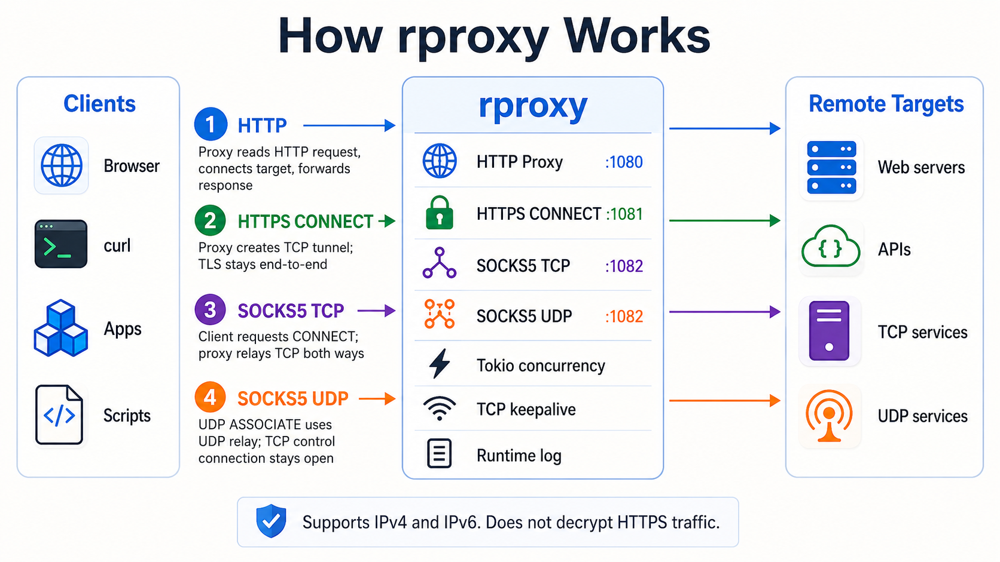
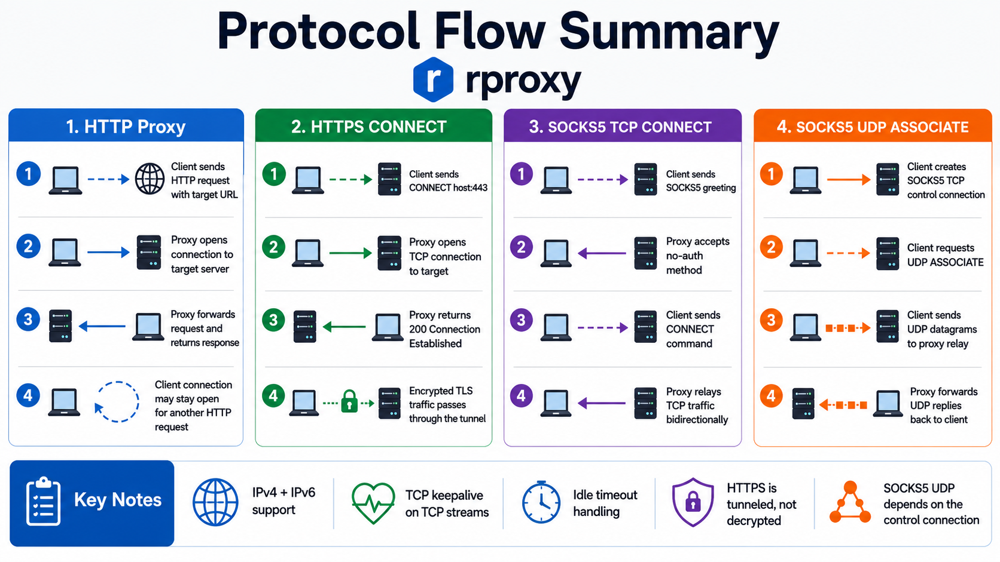

# rproxy

`rproxy` is a small Rust proxy server licensed under `AGPL-3.0-only`.

It provides local proxy services for HTTP, HTTPS CONNECT, SOCKS5 TCP, and SOCKS5 UDP ASSOCIATE. The server uses Tokio for concurrent asynchronous networking, supports IPv4 and IPv6 loopback listeners, configures TCP keepalive for TCP streams, and writes important runtime events to both the terminal and a local log file.

Default local services:

```text
HTTP proxy:        127.0.0.1:1080 and [::1]:1080
HTTPS CONNECT:     127.0.0.1:1081 and [::1]:1081
SOCKS5 TCP:        127.0.0.1:1082 and [::1]:1082
SOCKS5 UDP:        127.0.0.1:1082 and [::1]:1082
Log file:          rproxy.log
License:           AGPL-3.0-only
```

## Supported proxy modes

`rproxy` supports four proxy modes:

1. HTTP proxy on port `1080`.
2. HTTPS CONNECT proxy on port `1081`.
3. SOCKS5 TCP proxy on port `1082`.
4. SOCKS5 UDP ASSOCIATE proxy on port `1082`.

The HTTP proxy handles normal HTTP proxy traffic.

The HTTPS proxy uses the standard HTTP `CONNECT` method. After the tunnel is established, `rproxy` does not decrypt or inspect HTTPS traffic. It only forwards bytes between the client and the remote server. This means normal HTTPS-over-TCP traffic is supported.

The SOCKS5 TCP proxy supports the SOCKS5 `CONNECT` command.

The SOCKS5 UDP proxy supports the SOCKS5 `UDP ASSOCIATE` command. The UDP association depends on the original SOCKS5 TCP control connection staying open.

## How rproxy works

The following diagrams provide a quick visual overview of how `rproxy` handles HTTP, HTTPS CONNECT, SOCKS5 TCP, and SOCKS5 UDP traffic.

### Architecture overview



### Protocol flow summary



## Keepalive behavior

`rproxy` configures TCP keepalive on TCP streams. This helps long-lived TCP tunnels detect broken connections.

HTTP client-side keep-alive is handled at a basic level. The proxy can keep the client connection open for additional HTTP requests when the response has a clear message boundary.

HTTPS keep-alive is handled through the CONNECT tunnel. The proxy does not parse TLS or HTTP inside the tunnel. The browser and the remote HTTPS server handle TLS, HTTP/1.1 keep-alive, or HTTP/2 multiplexing themselves inside the tunnel.

## IPv4 and IPv6 support

`rproxy` listens on both IPv4 loopback and IPv6 loopback by default:

```text
127.0.0.1
::1
```

The proxy can also connect to IPv4 targets, IPv6 targets, and domain names that resolve to IPv4 or IPv6 addresses.

## Not supported

This program does not support TLS decryption, HTTPS man-in-the-middle inspection, HTTP/2 CONNECT proxy semantics, HTTP/3 CONNECT-UDP, SOCKS5 username/password authentication, traffic filtering, access control, or upstream proxy chaining.

Do not expose this server directly to the public Internet. By default, it only listens on `127.0.0.1` and `::1`. If you change the listening address to `0.0.0.0` or `::`, you must add authentication, firewall rules, rate limits, and access control. Otherwise, it can become an open proxy.

## Dependencies

The project currently uses:

```toml
tokio = "1.52.3"
socket2 = "0.6.4"
```

`tokio` provides the asynchronous runtime, TCP and UDP networking, task scheduling, timers, and synchronization primitives.

`socket2` provides lower-level socket configuration used by this project for IPv4 and IPv6 listeners, socket options, and TCP keepalive settings.

## Cargo configuration

The project includes this file:

```text
.cargo/config.toml
```

This avoids asking users to set `RUSTFLAGS` manually.

For Windows MSVC builds, the project-level Cargo configuration passes `/DEBUG:NONE` to the linker so the release build does not generate a `.pdb` file.

Linux, macOS, and Windows GNU builds are not affected by this MSVC-specific linker argument.

## Local deployment on Linux or macOS

Copy and run the following commands:

```bash
git clone https://github.com/wangyifan349/rproxy.git
cd rproxy
cargo fmt --check
cargo check --release --verbose
cargo clippy --release --all-targets --all-features --verbose -- -D warnings
cargo build --release --verbose
./target/release/rproxy
```

You can also run the included deployment script:

```bash
git clone https://github.com/wangyifan349/rproxy.git
cd rproxy
chmod +x scripts/check_build_run_unix.sh
./scripts/check_build_run_unix.sh
./target/release/rproxy
```

## Local deployment on Windows PowerShell

Copy and run the following commands in PowerShell:

```powershell
git clone https://github.com/wangyifan349/rproxy.git
cd rproxy
cargo fmt --check
if ($LASTEXITCODE -ne 0) { exit $LASTEXITCODE }
cargo check --release --verbose
if ($LASTEXITCODE -ne 0) { exit $LASTEXITCODE }
cargo clippy --release --all-targets --all-features --verbose -- -D warnings
if ($LASTEXITCODE -ne 0) { exit $LASTEXITCODE }
cargo build --release --verbose
if ($LASTEXITCODE -ne 0) { exit $LASTEXITCODE }
.\target\release\rproxy.exe
```

You can also run the included deployment script:

```powershell
git clone https://github.com/wangyifan349/rproxy.git
cd rproxy
cargo clean
powershell -ExecutionPolicy Bypass -File .\scripts\check_build_run_windows_no_pdb.ps1
.\target\release\rproxy.exe
```

```
cargo clean
$env:RUSTFLAGS = "-C debuginfo=0 -C strip=symbols"
cargo fmt --check
cargo clippy
cargo check --all-targets --all-features
cargo build --release
```

## Browser proxy configuration

Use the following local proxy settings:

```text
HTTP proxy:   127.0.0.1:1080
HTTPS proxy:  127.0.0.1:1081
SOCKS5 proxy: 127.0.0.1:1082
```

For IPv6 loopback, use:

```text
HTTP proxy:   ::1:1080
HTTPS proxy:  ::1:1081
SOCKS5 proxy: ::1:1082
```

## Runtime log

The server prints important information to the terminal and writes the same information to:

```text
rproxy.log
```

The log includes startup information, accepted connections, HTTPS CONNECT tunnels, SOCKS5 TCP connections, SOCKS5 UDP relay events, and important errors.

## Release build profile

The release profile is configured for smaller binaries:

```toml
[profile.release]
opt-level = "z"        # Optimize for binary size (smallest output, more aggressive than "s")
lto = true             # Enable Link Time Optimization for cross-crate global optimizations
codegen-units = 1      # Single codegen unit for maximum optimization at the cost of compile time
panic = "abort"        # Abort on panic instead of unwinding; reduces binary size and improves performance
strip = true           # Strip symbols and debug information from the final binary
debug = false          # Disable debug information in release builds
incremental = false    # Disable incremental compilation for cleaner and more optimized builds
overflow-checks = false # Disable integer overflow checks for performance (assumes correctness is ensured)
```

## ☕ Buy Me a Coffee

If this project helps you, please consider buying me a coffee. ☕

I built this project with care, patience, and many late nights. Open-source software may look simple from the outside, but every feature, bug fix, and improvement takes real time and effort. ❤️

Your support is never required, but it would be deeply appreciated. Thank you for your kindness and support. 🙏

### ₿ Bitcoin (BTC)

```text
bc1qxqfhumpqtnxrznkx9r4xsp8m6zsedtgusjns7p
```

### ⟠ Ethereum (ETH)

```text
0x2d92f9e4d8ac7effa9cd7cd5eccd364cac7c201b
```

### 💵 USDT (ERC-20)

```text
0x2d92f9e4d8ac7effa9cd7cd5eccd364cac7c201b
```

### ◎ Solana (SOL)

```text
B7N4e3KG9zWQBwMrtydS1B9wVBp2w62fAdryZdxAMBiz
```

## License

This project is licensed under the GNU Affero General Public License v3.0 only.

SPDX identifier:

```text
AGPL-3.0-only
```

The full license text is included in the `LICENSE` file.


## Transparent Proxy (Non-VPN)
This project must not be treated as a VPN.
It is a transparent proxy that performs protocol forwarding only and provides no security,
privacy protection, or traffic obfuscation.
All security properties depend entirely on the upstream protocols;
the proxy itself does not add any encryption or access protection.
